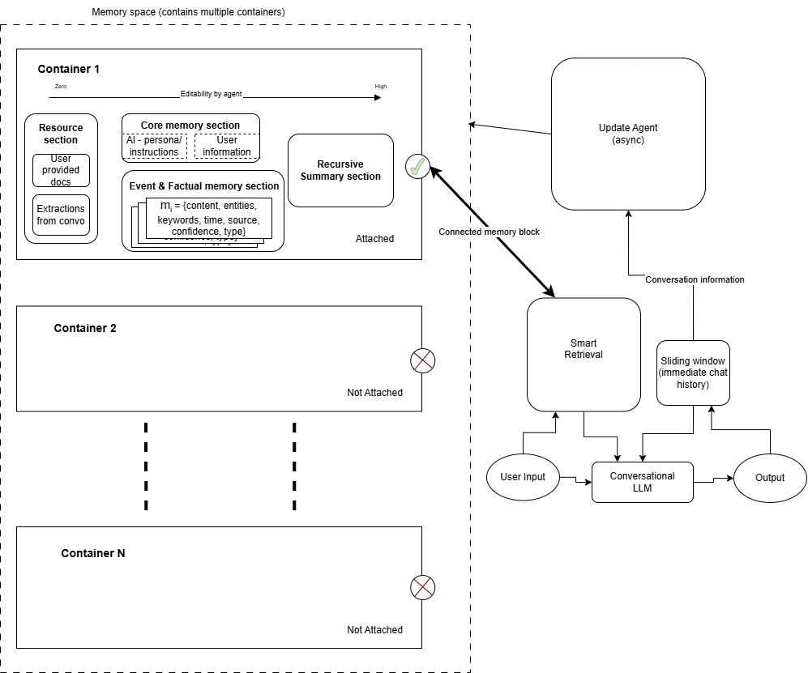

# MemBlocks

> Python library for modular memory management in LLM applications with intelligent retrieval and context organization



## Overview

**MemBlocks** is a Python library that solves the context problem in LLM applications. Instead of sending entire chat histories or using basic RAG, MemBlocks provides modular, intelligent memory management that organizes information the way humans do.

This repository contains:
- **`memblocks_lib/`** - The core Python library (install with `pip install memblocks`)
- **Demo applications** showing how to use the library in different contexts
- **Evaluation harness** for benchmarking retrieval performance

### The Problem

LLMs lose context over time. Current solutions either:
- Send full chat histories (expensive, hits token limits)
- Use basic RAG (treats all memory the same, creates noise)
- Lack organization (can't separate work from personal, or share team knowledge)

### The Solution

MemBlocks introduces **memory blocks as cartridges** - attachable, detachable, shareable memory spaces with intelligent retrieval:

- **Modular Memory Blocks**: Like game cartridges - swap contexts on demand
- **Layered Memory Types**: Core, Semantic, Episodic, and Resources - each optimized
- **Intelligent Retrieval**: LLM-powered query understanding with multi-strategy search
- **Team Collaboration**: Share memory blocks across team members
- **Source Transparency**: Know where every piece of context comes from

## Features

### Memory Architecture

Each memory block contains four distinct types of memory:

- **Core Memory**: Always-present essential facts (persona, user preferences)
- **Semantic Memory**: Timestamped facts and events (knowledge base)
- **Episodic Memory**: Conversation summaries (session history)
- **Resources**: Chunked documents (uploaded PDFs, guides, manuals)

### Intelligent Retrieval System

Not just vector search - a multi-stage intelligent system:

1. **Query Understanding**: LLM extracts intent, entities, and temporal context
2. **Section Routing**: Different searches for facts vs conversations vs documents
3. **Parallel Retrieval**: Search all relevant sections simultaneously
4. **Intelligent Reranking**: Considers recency, source, and entity matches
5. **Budget-Aware Assembly**: Fit context within token limits with diversity

## Quick Start

### Prerequisites

- Python 3.11+
- Docker & Docker Compose
- UV package manager ([install guide](https://github.com/astral-sh/uv))

### Installation

1. **Clone the repository**
   ```bash
   git clone <your-repo-url>
   cd MemBlocks
   ```

2. **Set up environment**
   ```bash
   cp .env.example .env
   # Edit .env with your API keys (Groq, OpenRouter, Cohere, etc.)
   ```

3. **Install dependencies**
   ```bash
   uv sync --all-packages
   ```

4. **Start infrastructure**
   ```bash
   docker-compose up -d
   ```
   
   This starts:
   - Qdrant (vector database) on port 6333
   - Ollama (embeddings) on port 11434

### Basic Usage

```python
from memblocks import MemBlocksClient

# Initialize
client = MemBlocksClient()

# Create memory block
block = await client.create_block(
    name="Work Projects",
    description="Memory for work-related projects"
)

# Add memory
await client.add_semantic_memory(
    block_id=block.id,
    content="Project deadline is March 25, 2024"
)

# Query memory
results = await client.query(
    block_id=block.id,
    query="When is the project deadline?",
    top_k=5
)

print(results[0].content)  # "Project deadline is March 25, 2024"
```

See the [Library Documentation](docs/memblockslib_docs/) for complete API reference.

## Repository Structure

This repository is organized as a UV workspace monorepo:

### Core Library

```
memblocks_lib/           # Core Python library - the heart of MemBlocks
├── src/memblocks/       # Library source code
│   ├── client.py        # Main MemBlocksClient API
│   ├── services/        # Memory operations (semantic, episodic, core, resources)
│   ├── storage/         # Vector DB and persistence layer
│   ├── llm/             # LLM provider integrations
│   ├── models/          # Data models and schemas
│   └── prompts/         # LLM prompts for query understanding & extraction
└── pyproject.toml       # Library dependencies
```

**What it does**: Provides the complete memory management system as a Python package. Install with `uv pip install -e memblocks_lib` or use directly in code.

**Key components**:
- **Client API** (`client.py`): High-level interface for creating blocks, storing/querying memories
- **Services** (`services/`): Business logic for each memory type (semantic, episodic, core, resources)
- **Storage** (`storage/`): Qdrant vector database operations, chunking, embedding
- **LLM Integration** (`llm/`): Provider-agnostic LLM calling for Groq, OpenRouter, etc.
- **Models** (`models/`): Pydantic schemas for memory blocks, queries, results

### Demo Applications

The following folders demonstrate different ways to use the MemBlocks library:

#### 1. REST API Backend (`backend/`)

```
backend/                 # FastAPI REST API demo
├── src/api/             # API routes and endpoints
│   ├── main.py          # FastAPI app entrypoint
│   ├── routes/          # Block, memory, session endpoints
│   └── middleware/      # Authentication (Clerk), CORS
└── pyproject.toml       # Backend dependencies
```

**Purpose**: Shows how to wrap MemBlocks in a REST API for web/mobile apps.

**Run it**:
```bash
uv run python -m uvicorn backend.src.api.main:app --reload
```

**Connects to**: `memblocks_lib` as a Python dependency.

#### 2. MCP Server (`mcp_server/`)

```
mcp_server/              # Model Context Protocol server demo
├── server.py            # MCP server implementation
├── cli.py               # CLI for block management
├── state.py             # Shared state management
└── pyproject.toml       # MCP server dependencies
```

**Purpose**: Shows how to integrate MemBlocks with AI assistants (Claude Desktop, OpenCode, Cline) using the MCP protocol.

**Run it**: Configure in your AI assistant's MCP settings (see [MCP README](mcp_server/README.md)).

**Connects to**: `memblocks_lib` as a Python dependency.

#### 3. Web Frontend (`frontend/`)

```
frontend/                # React web UI demo
├── src/
│   ├── api/client.js    # API client for backend
│   ├── components/      # ChatInterface, BlockManager, AnalyticsPanel
│   └── pages/           # Landing, Workspace
└── package.json         # Node dependencies
```

**Purpose**: Shows how to build a web interface for MemBlocks.

**Run it**:
```bash
cd frontend && npm install && npm run dev
```

**Connects to**: `backend/` REST API (not directly to the library).

### Supporting Folders

#### Evaluation (`evaluation/`)

```
evaluation/              # Benchmarking and performance testing
├── run_memblocks_evaluation.py  # Main evaluation runner
├── datasets/            # Test message datasets
├── methods/             # Configuration variants to compare
└── runs/                # Output metrics and reports
```

**Purpose**: Benchmark MemBlocks retrieval quality, token usage, and latency against baselines (e.g., full chat history).

**Run it**:
```bash
uv run python evaluation/run_memblocks_evaluation.py --enforce-30
```

**Connects to**: `memblocks_lib` as a Python dependency.

#### Tests (`tests/`)

```
tests/                   # Integration tests
├── test_hybrid.py       # Hybrid retrieval tests
└── test_store_tools.py  # Storage operations tests
```

**Purpose**: Integration tests for the library.

**Run it**:
```bash
uv run pytest tests/
```

#### Documentation (`docs/`)

```
docs/
└── memblockslib_docs/   # Library documentation
    ├── 01_SETUP_GUIDE.md
    ├── 02_METHODS_AND_INTERFACES.md
    └── 03_TECHNICAL_OVERVIEW.md
```

**Purpose**: Comprehensive documentation for the MemBlocks library API, architecture, and usage patterns.

### Infrastructure

```
docker-compose.yml       # Qdrant + Ollama services
pyproject.toml           # UV workspace configuration
.env.example             # Environment template
```

**What it does**: Defines the required services (Qdrant vector DB, Ollama embeddings) and workspace structure.

## How It All Connects

```
┌─────────────────────────────────────────────────────────────┐
│                    MemBlocks Library                        │
│                   (memblocks_lib/)                          │
│                                                             │
│  ┌──────────┐  ┌──────────┐  ┌──────────┐  ┌──────────┐   │
│  │ Client   │→ │ Services │→ │ Storage  │→ │ Qdrant   │   │
│  │   API    │  │ (Memory) │  │ (Vector) │  │ + Ollama │   │
│  └──────────┘  └──────────┘  └──────────┘  └──────────┘   │
│                                                             │
└──────────────┬────────────┬─────────────┬──────────────────┘
               │            │             │
       ┌───────▼───┐  ┌─────▼─────┐  ┌───▼────────┐
       │  Backend  │  │    MCP    │  │ Evaluation │
       │  (REST)   │  │  Server   │  │  Harness   │
       └─────┬─────┘  └───────────┘  └────────────┘
             │
       ┌─────▼─────┐
       │ Frontend  │
       │  (React)  │
       └───────────┘
```

**Flow**:
1. **Library** (`memblocks_lib/`) is the core - all other components depend on it
2. **Backend** (`backend/`) wraps the library in a REST API
3. **Frontend** (`frontend/`) consumes the backend API for web UI
4. **MCP Server** (`mcp_server/`) uses the library directly for AI assistant integration
5. **Evaluation** (`evaluation/`) uses the library directly for benchmarking
6. All components connect to shared infrastructure (Qdrant, Ollama) via Docker Compose

## Documentation

Comprehensive documentation is available in the [`docs/memblockslib_docs/`](docs/memblockslib_docs/) folder:

- **[Setup Guide](docs/memblockslib_docs/01_SETUP_GUIDE.md)** - Installation and configuration
- **[Methods and Interfaces](docs/memblockslib_docs/02_METHODS_AND_INTERFACES.md)** - Complete API reference
- **[Technical Overview](docs/memblockslib_docs/03_TECHNICAL_OVERVIEW.md)** - Architecture and design decisions

Demo-specific documentation:
- **[Backend README](backend/ReadMe.md)** - REST API setup and usage
- **[Frontend README](frontend/README.md)** - Web UI setup and architecture
- **[MCP Server README](mcp_server/README.md)** - MCP integration guide
- **[Evaluation README](evaluation/README.md)** - Benchmarking and evaluation

## Key Concepts

### Memory Blocks as Cartridges

Think of memory blocks like game cartridges or USB drives:
- **Swap contexts**: Switch between work, personal, learning blocks
- **Share knowledge**: Team blocks visible to all members
- **Keep separate**: Work never mixes with personal memories
- **Reduce noise**: Only search relevant blocks

### Multi-Layered Memory

Different memory types need different strategies:

| Type | Purpose | Strategy |
|------|---------|----------|
| **Core** | Always present | No search needed |
| **Semantic** | Facts & events | Entity + temporal search |
| **Episodic** | Conversation history | Session-based retrieval |
| **Resources** | Documents | Chunk-based semantic search |

### Intelligent vs Basic RAG

**Basic RAG**:
- Dump everything in one vector DB
- Embed query, return top results
- Hope for the best

**MemBlocks**:
- Understands query intent with LLM
- Routes to appropriate memory sections
- Searches with section-specific strategies
- Reranks for quality (recency, source, entities)
- Tags results with source transparency

## Configuration

Key environment variables (see `.env.example` for complete list):

```bash
# LLM Providers (choose one or more)
GROQ_API_KEY=your_groq_key
OPENROUTER_API_KEY=your_openrouter_key

# Vector Database
QDRANT_HOST=localhost
QDRANT_PORT=6333

# Embeddings
OLLAMA_BASE_URL=http://localhost:11434

# Reranking (improves retrieval quality)
COHERE_API_KEY=your_cohere_key

# Authentication (for backend API demo only)
CLERK_PUBLISHABLE_KEY=your_clerk_key
CLERK_SECRET_KEY=your_clerk_secret
```

## Library Usage Examples

### Example 1: Personal AI Assistant with Memory

```python
# Create separate blocks for different contexts
work_block = await client.create_block(name="Work")
personal_block = await client.create_block(name="Personal")

# Work conversation - stores in work block
await client.add_semantic_memory(
    block_id=work_block.id,
    content="Meeting is at 2pm tomorrow"
)

# Personal conversation - stores in personal block
await client.add_semantic_memory(
    block_id=personal_block.id,
    content="Dinner reservation at 7pm"
)

# Later queries only search relevant context
work_results = await client.query(work_block.id, "when is the meeting?")
# Doesn't search personal memories - no noise!
```

### Example 2: Team Knowledge Base

```python
# Shared team block
team_block = await client.create_block(
    name="Engineering Team Docs",
    shared_with=["user2", "user3", "user4"]
)

# Anyone on team can add knowledge
await client.add_semantic_memory(
    block_id=team_block.id,
    content="AWS credentials are in 1Password under 'Production Access'"
)

# Everyone sees the same knowledge
results = await client.query(team_block.id, "where are AWS credentials?")
# Returns: "AWS credentials are in 1Password..."
```

### Example 3: Document Q&A System

```python
# Upload documentation
doc_block = await client.create_block(name="API Documentation")

await client.upload_resource(
    block_id=doc_block.id,
    file_path="./api_guide.pdf"
)

# Automatically chunks, embeds, and stores

# Query documentation
results = await client.query(
    block_id=doc_block.id,
    query="How do I authenticate API requests?",
    top_k=3
)

# Returns relevant chunks with source citations
for result in results:
    print(f"{result.content}")
    print(f"Source: {result.metadata['filename']}, Page {result.metadata['page']}")
```

## Why MemBlocks?

### vs Mem0/MemGPT
They have one memory pool. We have **modular blocks** with internal organization.

### vs Zep
They focus on session memory. We separate **facts, conversations, and documents** into distinct sections.

### vs Standard RAG
We don't just search - we **extract intent**, route intelligently, search differently per section, and **rerank**.

### vs MIRIX
Similar active retrieval concept, but we add **modularity (blocks)** and **section-specific optimization**.

## Development

### Running Tests

```bash
# All tests
uv run pytest tests/

# Specific test file
uv run pytest tests/test_hybrid.py

# With coverage
uv run pytest --cov=memblocks_lib tests/
```

### Workspace Structure

This is a UV workspace with three Python packages:

```toml
[tool.uv.workspace]
members = ["memblocks_lib", "backend", "mcp_server"]
```

Install all packages in development mode:
```bash
uv sync --all-packages
```

### Running Demo Applications

**Backend API**:
```bash
uv run python -m uvicorn backend.src.api.main:app --reload
```

**Frontend**:
```bash
cd frontend && npm run dev
```

**MCP Server** (via OpenCode):
```json
{
  "mcp": {
    "memblocks": {
      "type": "local",
      "command": ["uv", "run", "python", "-m", "mcp_server.server"],
      "environment": {"MEMBLOCKS_USER_ID": "your_user_id"}
    }
  }
}
```

**Evaluation**:
```bash
uv run python evaluation/run_memblocks_evaluation.py --enforce-30
```

## Contributing

Contributions are welcome! Please:
1. Fork the repository
2. Create a feature branch
3. Make your changes
4. Add tests
5. Submit a pull request

## License

[Your License Here - e.g., MIT]

## Support

- **Issues**: [GitHub Issues](https://github.com/your-repo/issues)
- **Discussions**: [GitHub Discussions](https://github.com/your-repo/discussions)
- **Documentation**: See [docs/](docs/) folder

---

**Built for better LLM memory management** - because context matters.
